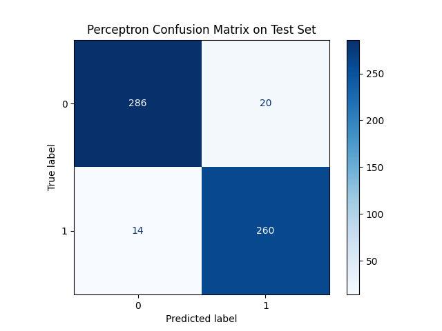

# 🧠 Perceptron Algorithm from Scratch

This project implements a **binary Perceptron classifier** from scratch using **NumPy** and optionally **Pandas** and **matplotlib**.  
It includes data loading, training, prediction, and visualization — without using any machine learning libraries like scikit-learn (except for evaluation).

---

## 📌 Features

- Implements the Perceptron algorithm manually
- Supports CSV-based training and test datasets
- Works with multi-feature data
- Visualization of:
  - Accuracy
  - Confusion Matrix
  - Misclassified points (optional)
- Clean, beginner-friendly code structure

---

## 📷 Sample Output

  

